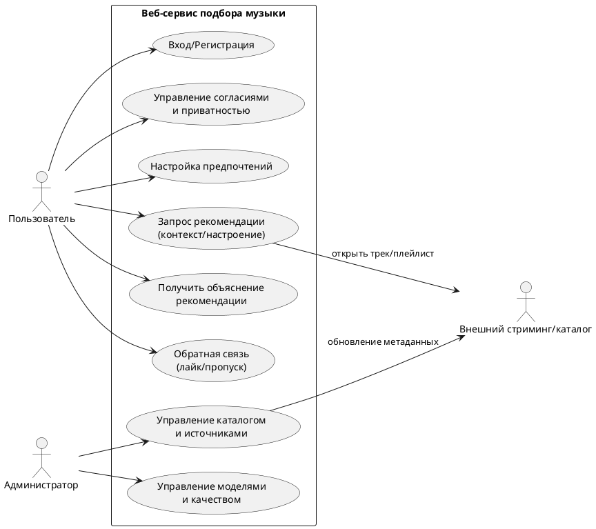
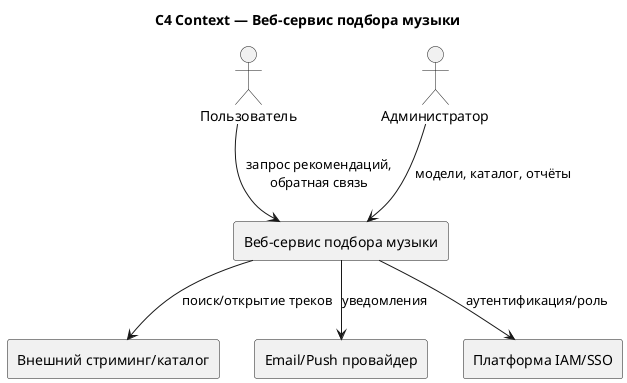
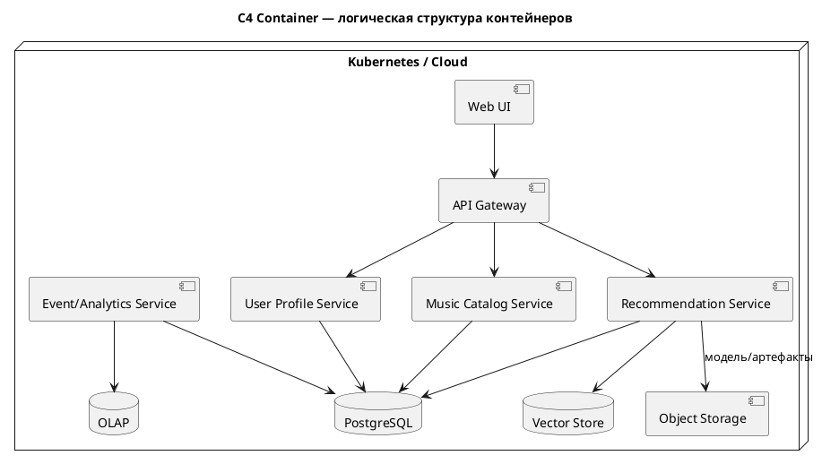
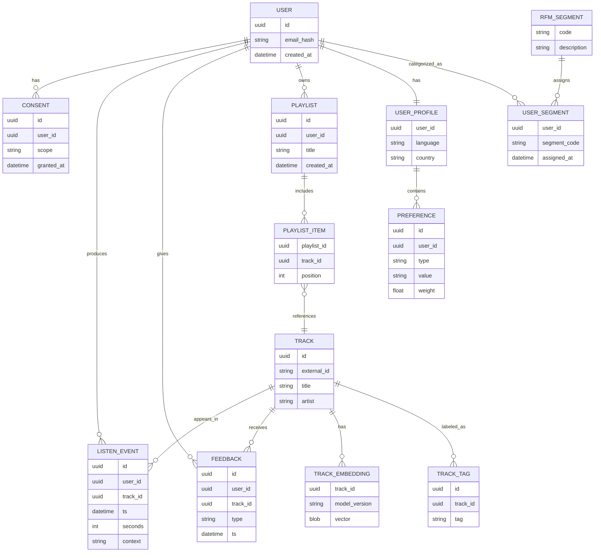
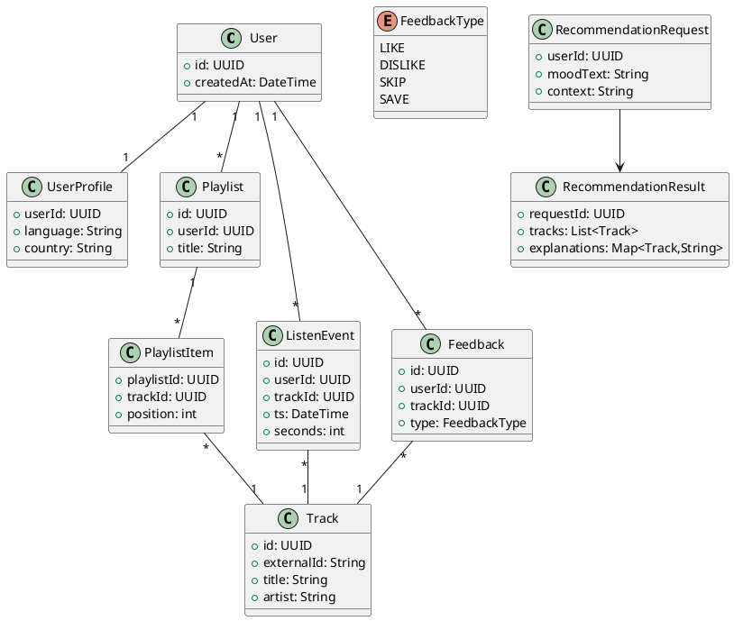

# Концепция дипломного проекта: "Разработка веб-сервиса по подбору музыкальных произведений с использованием элементов искусственного интеллекта"

## 0. Проблема

Современные музыкальные каталоги огромны, и пользователь регулярно сталкивается с выбором: *что послушать прямо сейчас*, *как найти новое*, *как быстро собрать плейлист под настроение/задачу*. Типовые проблемы текущего рынка:

- **Переизбыток контента**: ручной поиск занимает много времени, результаты часто повторяются.
- **Слабая персонализация**: рекомендации не учитывают контекст (настроение, активность, время суток) и быстро «зацикливаются».
- **Низкая объяснимость**: пользователю не ясно, почему выдан конкретный трек/плейлист, падает доверие.
- **Риски приватности**: история прослушиваний и предпочтения относятся к персональным данным и поведенческим профилям.
- **Интеграции**: пользователь переключается между сервисами (стриминг, соцсети, мессенджеры), нет единого сценария.

Цель проекта — разработать веб‑сервис, который подбирает музыкальные произведения под пользователя и контекст, используя элементы ИИ (модель рекомендаций и анализ контекста), и обеспечивает прозрачный клиентский путь.

## 1. Сценарии

1. Проблемы текущего состояния:

- Поиск музыки «в моменте» занимает время; пользователь бросает попытки и слушает привычное.
- Рекомендации существующих сервисов не учитывают **состояние/контекст** и часто повторяются.
- Нет удобного способа сформулировать запрос: «хочу *спокойное, как Lo‑Fi, но с живыми инструментами*».
- Сложно контролировать приватность: что собирается, зачем, как удалить.

2. Решающие особенности инструмента:

- **Гибридная рекомендательная система**: сочетание контентных признаков (жанр/темп/настроение, эмбеддинги аудио/текста) и поведенческих сигналов.
- **Контекст и настроение**: подбор по цели (работа/спорт/сон), времени суток, описанию эмоций (текстом), а также по явной обратной связи.
- **Объяснения рекомендаций**: короткие причины («похоже на…», «в вашем любимом темпе…», «подходит под “успокоение”»).
- **Сегментация пользователей (RFM)**: различная стратегия удержания/возврата, персональные сценарии коммуникаций.
- **Безопасность и соответствие требованиям** (ФСТЭК №21, №17) для обработки ПДн и эксплуатации системы в защищённом контуре.

3. Ограничения:

- Сервис **не хранит и не раздаёт аудиоконтент**, если отсутствуют права; по умолчанию — рекомендации и переход/открытие в подключённом стриминге.
- Качество рекомендаций зависит от данных: на старте требуется «холодный старт» (опрос/seed‑плейлист/минимальные предпочтения).
- ИИ‑модели требуют регулярного переобучения и контроля качества (дрейф данных, переобучение, смещения).

4. Клиентский путь (Customer Journey Map)

| Стадия пути | Активности | Чувства | Опыт | Ожидания |
|---|---|---|---|---|
| **Осознание потребности** | - «Не знаю, что включить» - Понимание задачи: работа/поездка/тренировка - Формирование эмоционального запроса | `тревога`, `раздражение` → `надежда` | Переизбыток вариантов, хочется «быстро и в цель» | Получить подходящую музыку за 1–2 минуты |
| **Первый вход и онбординг** | - Регистрация/вход (SSO) - Согласия и приватность - Быстрый опрос предпочтений/seed‑артисты | `неловкость`, `сомнение` → `успокоение` | Важно не «утонуть» в настройках | Простой старт, ясные настройки приватности |
| **Запрос рекомендации** | - Выбор режима: «по настроению», «похожее», «новое» - Ввод эмоций/цели текстом - Получение плейлиста/подборки | `любопытство`, `интригованность` → `вдохновение` | Интерес усиливают объяснения «почему это» | Персонально и с понятными причинами |
| **Прослушивание и уточнение** | - Переход в стриминг / встроенный предпрослушиватель - Лайк/дизлайк/пропуск - Уточнение параметров (темп, энергия) | `удовлетворение` / `огорчение` | Быстрые реакции улучшают точность | Подбор должен улучшаться «на глазах» |
| **Возврат и удержание** | - Еженедельные подборки - Напоминания по контексту (вечер/спорт) - Сохранение плейлистов | `лояльность`, `благодарность` | Сервис становится привычкой | «Умные», но ненавязчивые уведомления |
| **Доверие и контроль** | - «Почему рекомендовано?» - Просмотр/удаление истории - Экспорт данных/настроек | `моральная тревога`, `сомнение` → `уважение`, `успокоение` | Прозрачность повышает доверие | Контроль данных и объяснимость ИИ |

5. RFM‑анализ и сегментация клиентских путей

RFM‑сегментация применяется к событиям использования сервиса (например: создание подборки, сохранение плейлиста, переход в стриминг), чтобы различать сценарии удержания.

| Сегмент | R (давность) | F (частота) | M (сумма/ценность) | Типовой путь | Индивидуальный подход |
|---|---:|---:|---:|---|---|
| **Новые** | низкая | низкая | низкая | Онбординг → 1–2 подборки → оценка удобства | Обучающие подсказки, «быстрый успех», приглашение в лояльность |
| **Регулярные** | низкая | средняя/высокая | средняя | Запрос → прослушивание → сохранение плейлистов | Персональные дайджесты, A/B «новинки vs похожее» |
| **VIP/Фанаты** | низкая | высокая | высокая | Частые сессии, коллекции, шеринг | Ранний доступ к фичам, закрытые подборки, тонкая настройка |
| **Уходящие** | высокая | ранее средняя | средняя | Ранее пользовались, затем пауза | Реактивация: «ваше любимое + новое», мягкие уведомления, опрос причин |
| **Редкие** | средняя/высокая | низкая | низкая | «По случаю» (поездка/праздник) | Сценарные шаблоны под задачи, минимум действий |

6. Полная формулировка задачи

Разработать **веб‑сервис подбора музыкальных произведений**, который:
- предоставляет пользователю интерфейс настройки предпочтений и формулирования запроса (включая эмоциональный/контекстный);
- формирует рекомендации с помощью элементов ИИ (гибридная модель рекомендаций + контекстный анализ);
- поддерживает сбор обратной связи и улучшение качества (offline/online метрики, A/B тестирование);
- реализует архитектуру по C4 (контекст, контейнеры, компоненты, код/классы), матрицу Захмана и CJM;
- учитывает требования безопасности и организационно‑технических мер по ФСТЭК №21 и №17.

## 3. Архитектура

### 3.1 Функциональная архитектура

**Клиентские функции:**
- Регистрация/вход, управление согласиями и приватностью
- Настройка предпочтений (жанры, артисты, ограничения, «не рекомендовать»)
- Подбор музыки: по настроению/контексту, «похожее на…», «новое для меня», подборка под задачу
- Обратная связь (лайк/дизлайк/пропуск, сохранение плейлистов)
- Объяснения рекомендаций и управление историей данных

**Доменные функции сервиса:**
- Управление профилем и предпочтениями
- Каталогизация и обогащение метаданных (жанр, настроение, темп, тональность, теги)
- Профилирование поведения (события, сессии, RFM‑сегментация)
- Рассчёт рекомендаций (batch + online)
- Аналитика качества и мониторинг (метрики, A/B тесты)

**Административные функции:**
- Управление источниками каталога и правилами модерации
- Просмотр агрегированных отчётов (без доступа к ПДн без полномочий)
- Управление моделями (версии, деплой, откат)

### 3.2. Программная архитектура (контейнеры)

Архитектура ориентирована на микросервисный подход и переиспользование **базовых сервисов платформенного уровня** (по аналогии с подходом «ГосТех»: единые сервисы идентификации, интеграции, логирования/аудита, уведомлений, мониторинга).

**Контейнерная схема (функционально‑технический взгляд)**

| Контейнер/сервис | Назначение | Технологическая реализация (пример) | Данные |
|---|---|---|---|
| **Web UI** | Личный кабинет, поиск/подбор, объяснения | SPA (React/Next.js) | Кэш сессии, настройки UI |
| **API Gateway** (базовый сервис) | Единая точка входа, маршрутизация, лимиты | Kong / Nginx / Envoy | Трассировки, правила |
| **IAM/SSO** (базовый сервис) | Идентификация/аутентификация, MFA, роли | Keycloak / иной IdP | Учётки, токены |
| **User Profile Service** | Профиль, согласия, предпочтения | Backend (Java/Kotlin/Go/Python) | Профиль, consent, блок‑листы |
| **Music Catalog Service** | Индексация каталога, метаданные | ETL + API | Треки/артисты/альбомы |
| **Recommendation Service (Online)** | Быстрый ответ на запрос, ранжирование Top‑N | FastAPI + model runtime | Фичи, кандидаты, объяснения |
| **ML Pipeline (Batch)** | Обучение/переобучение, валидация | Airflow/Prefect + MLflow | Датасеты, модели |
| **Event/Analytics Service** | Сбор событий, RFM, отчёты | Kafka + ClickHouse/OLAP | События, сегменты |
| **Vector Store** | Поиск по эмбеддингам (похожее) | Qdrant/pgvector | Эмбеддинги треков/пользователей |
| **Relational DB** | Транзакционные данные | PostgreSQL | Пользователи, предпочтения, каталоги |
| **Cache** | Сессии, быстрые фичи | Redis | Кэш рекомендаций |
| **Object Storage** (базовый сервис) | Модели, датасеты, бэкапы | S3‑совместимое хранилище | Артефакты ML |
| **Logging / Audit** (базовый сервис) | Журналы безопасности и действий | ELK/Opensearch | Аудит, события |
| **Monitoring** (базовый сервис) | Наблюдаемость, алерты | Prometheus/Grafana | Метрики/трейсы |
| **Notification Service** (базовый сервис) | Email/пуш/мессенджеры | Интеграции | Шаблоны, логи |

> Примечание: конкретный набор базовых сервисов может быть адаптирован под целевую платформу (корпоративное облако/Гособлако).

**Контекстная схема (UML use‑case, как работает предметная область; DFD не используется)**

### 3.3. Аппаратная архитектура

- Размещение в облачной инфраструктуре (Kubernetes‑кластер), разделение сред **dev/test/prod**.
- Выделение узлов под:
  - web/API (горизонтальное масштабирование),
  - базы данных (HA + репликация),
  - аналитические хранилища,
  - ML‑контур (CPU для ETL + при необходимости GPU для обучения).
- Сетевые зоны: публичная зона (Web/UI через WAF), приватная зона (сервисы и БД), отдельный контур для ML‑обучения.
- Резервное копирование и планы восстановления (RPO/RTO задаются в SLA).

### 3.4. Матрица С4

| Уровень | Что (Что делает) | Как (Каким образом) | Где (Где выполняется/кто владеет) | Когда (Когда выполняется) | Почему (Зачем нужно) |
|---|---|---|---|---|---|
| **Контекст** | Персональный подбор музыки под пользователя и контекст | Гибридные рекомендации + контекстный анализ + объяснения | Пользовательский интерфейс + интеграции со стримингом | В любой момент запроса пользователя | Сократить время поиска, повысить удовлетворённость и доверие |
| **Контейнер** | Набор веб‑контейнеров: UI, API, сервисы профиля/каталога/рекомендаций/аналитики | Микросервисы, API‑шлюз, очереди, БД, векторное хранилище | Облачная платформа/K8s, базовые сервисы (IAM, мониторинг, аудит) | Online‑инференс — в реальном времени; batch — по расписанию | Масштабируемость, независимое развитие модулей |
| **Компонент** | Внутри сервиса рекомендаций: кандидаты → фичи → ранжирование → объяснение | Feature store, модели, правила, фильтры качества | Recommendation Service + Vector Store + Profile Service | При каждом запросе и при обработке событий | Точный и быстрый результат с понятной логикой |
| **Код** | Классы/модули: Ranker, FeatureBuilder, FeedbackHandler, Segmenter | Реализация алгоритмов, контрактов API, валидация данных | Репозиторий кода и CI/CD | При развёртывании версий и обработке запросов | Конкретная реализация функций и тестируемость |

**C4‑диаграммы (код для визуализации)**

*C4 Context (упрощённо):*

*C4 Container (упрощённо):*

**Компонентная схема: только данные (документы и связи)**

### 3.4.1 Диаграмма классов (предметная область)

### 3.5 Матрица Захмана

| Перспектива \\ Аспект | Что (Данные) | Как (Функции) | Где (Расположение) | Кто (Люди) | Когда (Время) | Почему (Мотивация) |
|---|---|---|---|---|---|---|
| **Контекст** (Цели) | Предпочтения, каталог, история прослушиваний | Подбор музыки под контекст | Веб‑сервис + интеграции со стримингами | Пользователь, администратор | В момент запроса, периодические дайджесты | Быстро находить подходящую музыку, повышать настроение/эффективность |
| **Бизнес‑концепции** (Процессы) | Профиль, согласия, события, сегменты RFM | Онбординг → подбор → обратная связь → удержание | Каналы: web, email/push | Владелец продукта, аналитик, поддержка | «первый запуск», «ежедневная сессия», «реактивация» | Удержание, рост вовлечения, доверие |
| **Системная логика** (Архитектура) | Сущности User/Track/Playlist, эмбеддинги, фичи | Кандидатирование → ранжирование → объяснение | Микросервисы, API‑шлюз, БД/Vector DB | Разработчики, ML, DevOps, ИБ | Online и batch‑переобучения | Масштабируемость и качество рекомендаций |
| **Технология** (Компоненты) | PostgreSQL/OLAP/Vector Store, объектное хранилище | API, очереди, ETL, CI/CD | K8s, приватные сети, WAF/IDS | Администратор платформы, ИБ | Пайплайны по расписанию, релизы по версии | Надёжная эксплуатация и контроль изменений |
| **Детализация** (Код) | Схемы БД, контракты API, версии моделей | Реализация сервисов, тестирование | Репозитории, артефакт‑хранилище | Команда разработки | На каждом коммите/релизе | Быстрая поставка без потери качества |
| **Функционирование** (Инстанс) | Реальные данные, логи, инциденты | Реальные сессии, вычисление рекомендаций | Прод‑кластер, мониторинг | Пользователи, дежурная смена | 24/7, SLA | Стабильный сервис и доверие пользователей |

## 4. Взаимодействие с другими системами

- Музыкальные каталоги/стриминги: метаданные, deep‑link на треки/плейлисты, (опционально) импорт библиотек по OAuth.
- Уведомления: email, push, мессенджеры.
- Идентификация (IAM/SSO): единые учётные записи и роли.
- Мониторинг/логирование: метрики, трассировка, аудит.
- Платёжный провайдер (опционально): подписки/премиум‑функции.

## 5. Безопасность (ФСТЭК 21, 17)

Раздел задаёт концептуальные меры защиты для веб‑сервиса, который обрабатывает персональные данные и может эксплуатироваться в защищённом контуре. Конкретные уровни/классы определяются отдельной работой: модель угроз, категорирование, выбор мер и их подтверждение.

### 5.1 Обрабатываемые данные и активы

- ПДн: учётная запись, настройки, согласия, история действий и предпочтений.
- Поведенческие данные: события прослушивания, реакции, сегменты.
- Технические данные: логи, идентификаторы устройств/сессий, IP (в рамках журналирования).
- Артефакты ML: датасеты, модели, эмбеддинги.

### 5.2 Модель угроз 

- Компрометация учётных записей и токенов.
- Утечки ПДн через API/логи/хранилища, неверные права.
- Атаки на доступность (DDoS), злоупотребление API.
- Supply chain (уязвимые зависимости/образы).
- Риски ML‑контура: отравление данных, несанкционированный доступ к датасетам и моделям.

### 5.3 ФСТЭК №21 (меры по защите ПДн в ИСПДн)

Приказ ФСТЭК №21 определяет состав и содержание мер по обеспечению безопасности ПДн в ИСПДн. В числе мер (укрупнённо):

- идентификация и аутентификация субъектов доступа и объектов доступа;
- управление доступом субъектов доступа к объектам доступа;
- ограничение программной среды;
- защита машинных носителей информации;
- регистрация событий безопасности;
- антивирусная защита;
- обнаружение (предотвращение) вторжений;
- контроль (анализ) защищенности персональных данных;
- обеспечение целостности информационной системы и персональных данных;
- обеспечение доступности персональных данных;
- защита среды виртуализации;
- защита технических средств;
- защита информационной системы, ее средств, систем связи и передачи данных;
- выявление инцидентов и реагирование на них;
- управление конфигурацией информационной системы и системы защиты персональных данных.

| Группа мер (№21) | Реализация в проекте | Где реализуется |
|---|---|---|
| Идентификация и аутентификация | SSO/OAuth2/OIDC, MFA для администраторов, ротация токенов | IAM/SSO, API Gateway |
| Управление доступом | RBAC, принцип наименьших привилегий, разделение ролей (dev/ops/ML/аналитик) | Backend‑сервисы, БД |
| Ограничение программной среды | Контейнеризация, allow‑list образов, запрет запуска непроверенных артефактов | K8s/CI/CD |
| Регистрация событий безопасности | Централизованные логи, аудит действий админов, корреляция событий | Logging/SIEM |
| Защита сетей и передачи данных | TLS, сегментация, WAF/IDS, защита API | Периметр/сеть |
| Целостность | Подпись контейнеров, контроль конфигурации (IaC), checksum артефактов | CI/CD, K8s |
| Доступность | Rate limit, autoscaling, резервирование БД, DR‑план | Gateway, infra |
| Инциденты | Процедуры реагирования, роли, сроки, журналирование | SOC/ИБ |
| Управление конфигурацией | Контроль изменений, согласование, хранение версий | DevOps |

### 5.4 ФСТЭК №17 (требования к защите информации в ГИС)

Приказ ФСТЭК №17 определяет требования к защите информации (не составляющей гостайну), содержащейся в государственных информационных системах. В перечне мер защиты:

- идентификация и аутентификация субъектов доступа и объектов доступа;
- управление доступом субъектов доступа к объектам доступа;
- ограничение программной среды;
- защита машинных носителей информации;
- регистрация событий безопасности;
- антивирусная защита;
- обнаружение (предотвращение) вторжений;
- контроль (анализ) защищенности информации;
- обеспечение целостности информационной системы и информации;
- обеспечение доступности информации;
- защита среды виртуализации;
- защита технических средств;
- защита информационной системы, ее средств, систем связи и передачи данных;
- защита информационной системы от атак, направленных на отказ в обслуживании.

| Группа мер (№17) | Реализация в проекте |
|---|---|
| Учет/аутентификация | единый IAM, MFA, безопасные токены/сессии |
| Разграничение доступа | RBAC, разделение сетевых зон и контуров |
| Журналирование/аудит | централизованный аудит доступа к данным и изменениям моделей |
| Сетевая защита | DMZ, WAF, IDS/IPS, сегментация |
| DoS‑защита | rate limit, автомасштабирование, защита периметра |
| Управление уязвимостями | регулярные сканы, обновления, контроль зависимостей |

### 5.5 Итоговые ИБ‑принципы

- Минимизация ПДн и псевдонимизация (раздельное хранение идентификаторов и событий).
- Сквозное шифрование (TLS) и защита секретов.
- Контроль действий администраторов и операций с моделями (аудит, роли, откаты).
- Разделение ML‑контура и прод‑контура, ограничение доступа к датасетам.

## 6. Ресурсы (Экономика)

Укрупнённая оценка для дипломного проекта:

- Трудозатраты: Оценка в человеко-часах на разработку (кодирование, тестирование, отладка) - ~500 часов.
- Технологический стек: React + TypeScript, Scikit-learn, PostgreSQL, Docker, Yandex Music API.
- Аппаратные ресурсы: ПК/ноутбук. Дополнительного оборудования не требуется.
- Эксплуатационные расходы: Отсутствуют.
- Ключевые метрики:
  - продуктовые: конверсия в прослушивание, удержание D7/D30, CSAT/NPS, доля сохранённых плейлистов;
  - модельные: Precision@K, NDCG@K, coverage/diversity, снижение повторов.
